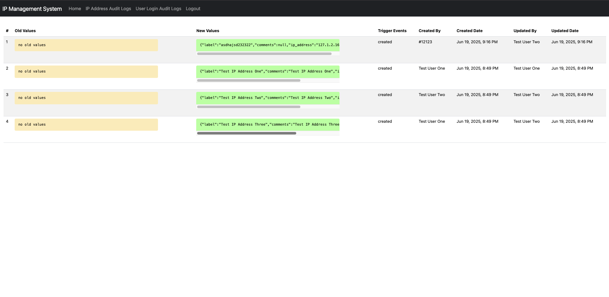

# Web Based IP Address Management System

---

## Development Environment Requirements

- PHP 8.4.8
- Composer version 2.8.9
- MySql  Ver 9.3.0
- Docker version 28.2.2
- Node Js v24.2.0 and npm 11.3.0 
- React Js 19.1.0
- Laravel Framework 10.48.29
- Guzzle, PHP HTTP client 7.9
- Postman

## Architectures

The system is built with four components using the Laravel framework:

- **Auth Service** – Handles authentication with JWT tokenization
- **IP Management Service** – Manages IP-related tasks using X-API-KEY authentication for API access
- **Gateway/Proxy Service** – Routes communication between clients (Auth Service and IP Management Service)
- **Web Client** – Provides a user interface connected to the Gateway Service

## Installation

 - Clone the repository:
   - `git clone git@github.com:jcarpizo/web-based-ip-address-management-system.git`
   - `cd web-based-ip-address-management-system`
 - Build and start the containers:
   - `docker-compose up --build`
   - - This will assign IP addresses, create databases, run migrations, and seed each service.
 - Done: Access the web client at:
      - http://127.0.0.1:8002/login

## Microservice Endpoints
 
- **Auth Service**  => http://127.0.0.1:8000/
- **Gateway Service** => http://127.0.0.1:8001/
- **Web Client** => http://127.0.0.1:8002/
- **IP Management Service** => http://127.0.0.1:8003/

## Initial Test User Credentials
Note: These accounts are for testing purposes only.

| Name          | Email           | Password | Role  |
|---------------|-----------------|----------|-------|
| Test User One | user1@gmail.com | 123456   | User  |
| Test User Two | user2@gmail.com | 123456   | User  |
| Admin User    | admin@gmail.com | 123456   | Admin |

## Screenshot Pages

### Register Page

--- 
### Login Page

--- 
### Standard User Page

--- 
### Admin User Page

--- 
### IP Address Audit Logs Page

--- 
### User Login and Logout Audit Logs Page

--- 
### Postman Request with Bearer Token from Gateway Service

--- 
### Postman Request Getting IP Address with X-API-KEY (Application API Key)

### Docker with PHP Unit Initial IP Address Test Case

## Future Improvements

- Caching mechanism using Redis 
- Pagination for IP addresses and audit logs 
- Enhanced UI design and interfaces 
- Improved security for cookies and local storage 
- Testing with PHPUnit and mocking objects 
- Expanded request and audit logging in the Gateway Service 
- Logging with Kibana monitoring tools
- Refactoring PHP and React.js codes
- QA automation testing using Java, Selenium, and Cucumber
- Exploring Rust for APIs with Axum or Rocket
